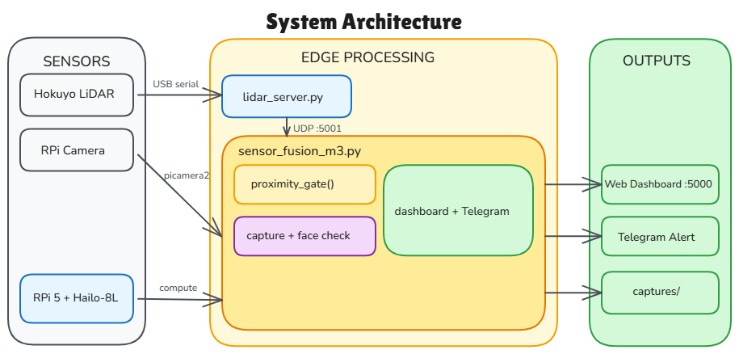
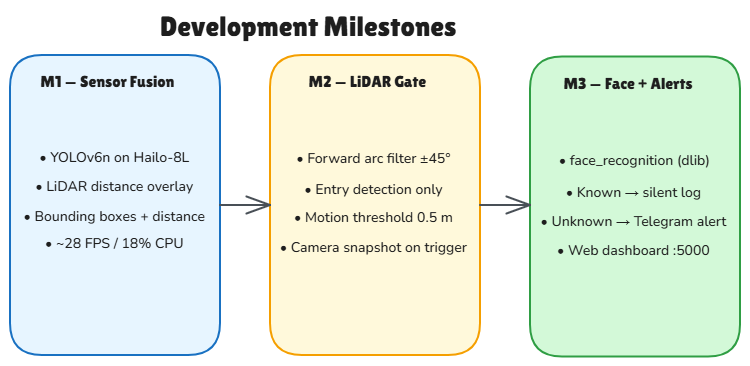
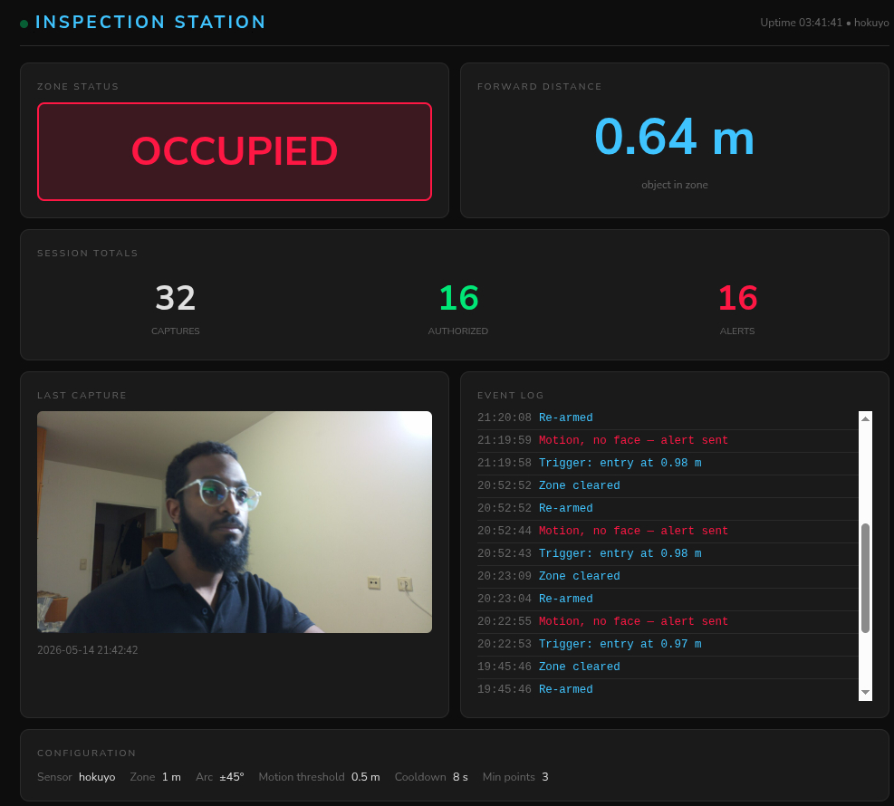
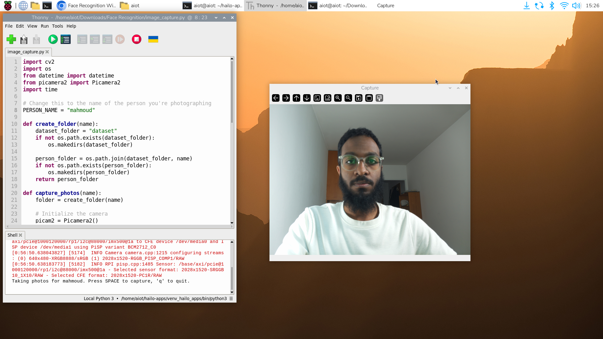

# AIoT Edge Inspection Station

A real-time indoor inspection station running on **Raspberry Pi 5** with a **Hailo-8L** neural processing unit, **Hokuyo URG-04LX-UG01** LiDAR, and RPi Camera Module. The system fuses camera-based object detection with LiDAR ranging to measure distances to detected objects, trigger proximity alerts, and — in the final milestone — perform face recognition with a web dashboard and Telegram notifications.

Built as part of a Master's course in AIoT Edge Computing.

---

## System Architecture



The system runs as three cooperating processes: a **LiDAR server** that reads the sensor over USB serial and broadcasts scan data as UDP JSON, a **detection pipeline** that runs YOLOv6n inference on the Hailo-8L NPU and fuses bounding boxes with LiDAR distances, and the **main orchestrator** (`sensor_fusion.py`) that spawns and supervises both.

---

## Development Milestones



| Milestone | Launcher | What it does | Requires Hailo? |
|-----------|----------|--------------|-----------------|
| **M1** — NPU Detection + LiDAR Fusion | `sensor_fusion.py` | YOLOv6n @ ~28 FPS on Hailo-8L; distance overlaid on every bounding box; real-time LiDAR polar map | Yes |
| **M2** — LiDAR Proximity Gate | `sensor_fusion_m2.py` | LiDAR triggers camera snapshots on entry; stateful cooldown prevents re-triggering | No |
| **M3** — Face Recognition + Dashboard | `sensor_fusion_m3.py` | Adds face recognition (dlib), Flask web dashboard, Telegram alerts for unknown visitors | No |

> **M3 is the complete final system.** M1 demonstrates hardware acceleration value. M2 is the LiDAR-only fallback.

---

## Screenshots

| Dashboard | Image Capture |
|-----------|---------------------|
|  |  |

---

## Hardware Requirements

| Component | Model / Details |
|-----------|----------------|
| Compute | Raspberry Pi 5 (4 GB or 8 GB RAM) |
| AI Accelerator | Hailo-8L M.2 HAT (required for M1 only) |
| LiDAR | Hokuyo URG-04LX-UG01 (USB → `/dev/ttyACM0`) |
| Camera | Raspberry Pi Camera Module v2 or v3 (CSI) |
| OS | Raspberry Pi OS 64-bit Bookworm |

---

## Setup

### 1. Install system packages

```bash
sudo apt update
sudo apt install hailo-all          # Hailo SDK + GStreamer plugins + picamera2
sudo apt install python3-venv python3-pip
```

### 2. Clone the repository

```bash
git clone https://github.com/engmahmoudosman/aiot-edge-inspection-station.git
cd aiot-edge-inspection-station
```

### 3. Create a virtual environment

The `--system-site-packages` flag is required so the venv can reach `hailo_platform`, `hailo_apps`, GStreamer bindings, and `picamera2`, which are installed system-wide by `hailo-all` and are not on PyPI.

```bash
python3 -m venv venv --system-site-packages
source venv/bin/activate
```

### 4. Install Python dependencies

```bash
pip install -r requirements.txt
```

### 5. Install face recognition (Milestone 3 only)

dlib must be compiled from source — this takes 30–60 minutes on the Pi:

```bash
sudo apt install -y cmake build-essential libopenblas-dev liblapack-dev \
                    libx11-dev libgtk-3-dev
pip install dlib
pip install face_recognition
```

### 6. Source the Hailo environment

Every terminal that runs Milestone 1 must source this first:

```bash
source ~/hailo-apps/setup_env.sh
```

Add it to `~/.bashrc` to run automatically on login.

### 7. Verify the Hailo model file

```bash
ls ~/hailo-apps/resources/models/hailo8l/yolov6n.hef
```

If missing, consult the [Hailo Developer Zone](https://developer.hailo.ai/) for pre-compiled HEF models.

### 8. Configure Telegram alerts (Milestone 3 only)

```bash
cp config.json.example config.json
nano config.json    # fill in your bot token and chat ID
```

See [Creating a Telegram bot](https://core.telegram.org/bots/tutorial) for how to obtain a token.

---

## Running the System

### Verify sensors first

**LiDAR check** (no camera or Hailo needed):
```bash
# Check USB device
ls /dev/ttyACM*        # expect /dev/ttyACM0

# Add yourself to the dialout group if needed
sudo usermod -aG dialout $USER && newgrp dialout

# Launch LiDAR viewer
python lidar_server.py --lidar hokuyo &
python lidar_cloud.py
```

**Camera check:**
```bash
libcamera-hello -t 5000           # 5-second live preview
```

**Hailo check:**
```bash
source ~/hailo-apps/setup_env.sh
hailortcli fw-control identify    # shows firmware version if detected
```

---

### Milestone 1 — NPU Object Detection + LiDAR Fusion

```bash
source ~/hailo-apps/setup_env.sh
python sensor_fusion.py
```

The display shows a camera feed with bounding boxes and distances on the left, and a LiDAR polar map on the right.

| Indicator | Meaning |
|-----------|---------|
| Green box | Detected object, distance in metres |
| Red box + banner | Object within safety threshold (default 1.5 m) |
| Green cone | Camera field of view (66.3°) |
| Dark-red ring | 1.5 m safety boundary on LiDAR map |

Press `Q` or `Ctrl+C` to stop cleanly.

---

### Milestone 2 — LiDAR Proximity Gate

No Hailo or face recognition required.

```bash
python sensor_fusion_m2.py --sensor hokuyo --proximity 1.5
```

The LiDAR monitors the entry zone. When something enters within the proximity threshold, the camera captures a snapshot. A cooldown prevents re-triggering on stationary objects.

```
Options:
  --sensor     hokuyo | rplidar      (default: hokuyo)
  --proximity  distance in metres    (default: 1.5)
```

---

### Milestone 3 — Face Recognition + Web Dashboard + Telegram

#### Enrol known faces first

```bash
mkdir -p known_faces/<person_name>
# Copy 3–5 clear face images into that folder
python -c "
import face_recognition, pickle, os, numpy as np
from pathlib import Path
encs = {}
for person in Path('known_faces').iterdir():
    imgs = [face_recognition.load_image_file(str(p))
            for p in person.glob('*.jpg')]
    vecs = [face_recognition.face_encodings(i)[0] for i in imgs
            if face_recognition.face_encodings(i)]
    if vecs:
        encs[person.name] = vecs
        print(f'Enrolled {person.name}: {len(vecs)} encoding(s)')
with open('encodings.pickle', 'wb') as f:
    pickle.dump(encs, f)
print('Saved encodings.pickle')
"
```

#### Run

```bash
python sensor_fusion_m3.py --sensor hokuyo --proximity 1.5
```

Open the web dashboard at `http://<pi-ip>:5000`

```
Options:
  --sensor     hokuyo | rplidar      (default: hokuyo)
  --proximity  distance in metres    (default: 1.5)
  --port       Flask port            (default: 5000)
```

**Alert behaviour:**

| Visitor type | Action |
|-------------|--------|
| Known face | Silent log entry |
| Unknown face | Photo + alert to Telegram |
| No face (motion only) | Motion alert to Telegram |

---

## Configuration Reference

All system parameters are in `config.yaml`:

```yaml
lidar:
  sensor: hokuyo           # hokuyo | rplidar
  udp_port: 5001

camera:
  input: rpi               # rpi | /dev/video0 | path/to/video.mp4
  hfov_deg: 66.3           # Camera horizontal field of view (degrees)

model:
  hef_path: "~/hailo-apps/resources/models/hailo8l/yolov6n.hef"
  score_threshold: 0.35    # Detection confidence threshold
  iou_threshold: 0.45      # NMS overlap threshold

fusion:
  band_min_px: 250         # Vertical pixel rows where the LiDAR scan plane
  band_max_px: 290         # intersects the camera image (480 px frame height)
  ema_alpha: 0.4           # Distance smoothing factor (0 = frozen, 1 = raw)
  ema_expire_sec: 1.0      # Seconds before a distance track expires

safety:
  enable_alerts: true
  distance_threshold_m: 1.5

logging:
  enable: true
  output_dir: ./logs

display:
  window_title: "Inspection Station"
  map_size_px: 640
  max_range_m: 4.0
  map_scale_px_per_m: 100
```

### Calibrating the fusion band

`band_min_px` / `band_max_px` define the horizontal strip in the camera image where the LiDAR scan plane crosses. This depends on sensor mounting height.

1. Place a flat object at exactly 1 m in front of the station.
2. Run `python sensor_fusion.py`.
3. If no distance appears next to the bounding box, widen the band (e.g., `200`–`340`).
4. Narrow it back until distance readings are consistent.

---

## Benchmarking

### Hailo-8L FPS (run while `sensor_fusion.py` is active)

```bash
# Terminal 1
python sensor_fusion.py

# Terminal 2
python benchmark_fps.py --mode hailo --duration 30
```

### CPU-only FPS (standalone, requires onnxruntime)

```bash
pip install onnxruntime
python benchmark_fps.py --mode cpu --duration 30 --onnx-path yolov6n.onnx
```

### LiDAR distance accuracy (run while `lidar_server.py` is active)

```bash
# Terminal 1
python lidar_server.py --lidar hokuyo

# Terminal 2 — repeat at each test distance
for dist in 0.5 1.0 1.5 2.0 2.5; do
    python distance_accuracy_test.py --distance $dist
done
```

Output is formatted for direct copy-paste into the paper tables.

---

## Event Logs

Detections are written to a daily rotating CSV:

```
./logs/inspection_YYYY-MM-DD.csv
```

| Column | Description |
|--------|-------------|
| `timestamp_iso` | ISO 8601 timestamp with milliseconds |
| `class_label` | Detected class (e.g., `person`) |
| `confidence` | Detection score (0–1) |
| `distance_m` | LiDAR-fused distance, empty if unavailable |
| `alert_triggered` | `True` if within safety threshold |

---

## Project Structure

```
inspection_station/
├── sensor_fusion.py                  # M1 launcher (Hailo + LiDAR)
├── sensor_fusion_m2.py               # M2 launcher (LiDAR gate)
├── sensor_fusion_m3.py               # M3 launcher (face recog + dashboard)
├── lidar_server.py                   # SCIP 2.0 serial driver → UDP JSON
├── detection_with_lidar.py           # Hailo GStreamer pipeline + LiDAR fusion
├── detection_pipeline_with_lidar.py  # GStreamer base class
├── inspection_dashboard.py           # LiDAR polar map renderer
├── inspection_logger.py              # Thread-safe CSV event logger
├── dashboard.py                      # Flask web dashboard (M3)
├── lidar_cloud.py                    # 360° point cloud viewer
├── benchmark_fps.py                  # FPS and CPU usage benchmarker
├── distance_accuracy_test.py         # LiDAR accuracy measurement tool
├── monitor_system.py                 # CPU/RAM profiler
├── ais.sh                            # Quick M3 launch script
├── benchmark_cpu.sh                  # CPU benchmark shell script
├── benchmark_npu.sh                  # NPU benchmark shell script
├── config.yaml                       # All tunable system parameters
├── config.json.example               # Telegram credentials template
├── requirements.txt                  # Python dependencies
├── .gitignore
└── images/
    ├── architecture.png
    ├── dev_milestones.png
    ├── dashboard.png
    └── image_capture.png
```

---

## Troubleshooting

| Symptom | Fix |
|---------|-----|
| `No such file: /dev/ttyACM0` | Try `ttyACM1`; check USB cable; verify user is in `dialout` group |
| `HailoRTException: Failed to scan` | Run `source ~/hailo-apps/setup_env.sh`; reseat M.2 HAT and reboot |
| No distance on bounding boxes | Widen fusion band in `config.yaml`; confirm `lidar_server.py` is running |
| Display window doesn't open | Connect HDMI, or use `ssh -X` for X forwarding |
| Camera feed black or frozen | Run `libcamera-hello -t 3000` to confirm camera; only one process can hold it |
| `ImportError: hailo_platform` | Not on PyPI — requires `sudo apt install hailo-all` on Raspberry Pi |
| `ImportError: face_recognition` | See [Setup step 5](#5-install-face-recognition-milestone-3-only) |

---

## License

MIT
